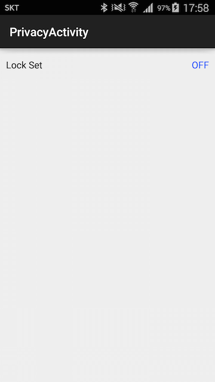
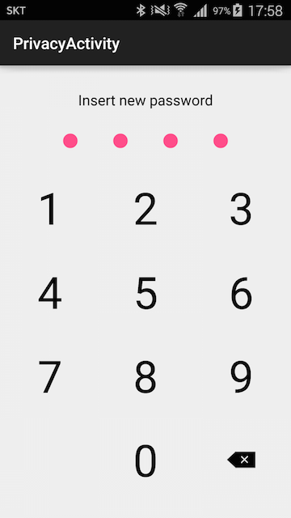
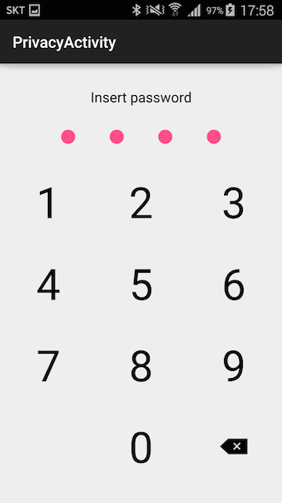

# Android-PrivacyActivity
it's not library project!<br/>
If you set lock, call password activity when you back from home or screen of.<br/>
See the code and mark your way. and.... I don't think it work well on lollipop..

if you want to use this one fix PrivacyActivity.java Line 74. This code for detecting application change by recent list. but getRunningTasks is deprecated. find other way and let me know how you fix it.
```java
@Override
public void onStop() {
		ActivityManager am = (ActivityManager) this.getSystemService(Context.ACTIVITY_SERVICE);
		List<RunningTaskInfo> list = am.getRunningTasks(1);

		// check if task goes other application package
		// it's not working on lollipop. fix it!
		for (RunningTaskInfo info : list) {
			  if (info.baseActivity.getClassName().indexOf(packageName) < 0) {
				    isBackFromHomeKey = true;
			  }
		}
		
		super.onStop();
}
```

## Screenshot
<br/>
<br/>
<br/>

## License
Copyright 2015 Mabi

Licensed under the Apache License, Version 2.0 (the "License");<br/>
you may not use this work except in compliance with the License.<br/>
You may obtain a copy of the License at

http://www.apache.org/licenses/LICENSE-2.0

Unless required by applicable law or agreed to in writing, software<br/>
distributed under the License is distributed on an "AS IS" BASIS,<br/>
WITHOUT WARRANTIES OR CONDITIONS OF ANY KIND, either express or implied.<br/>
See the License for the specific language governing permissions and<br/>
limitations under the License.
